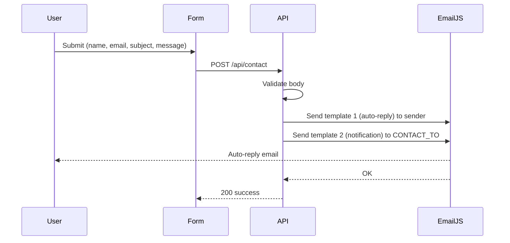

# EmailJS contact handling and dual emails

## Current state

- Contact form in [components/ContactForm.tsx](components/ContactForm.tsx) POSTs to `/api/contact`.
- [app/api/contact/route.ts](app/api/contact/route.ts) uses **nodemailer** and SMTP env vars to send a single email to `CONTACT_TO`.
- You want to switch to **EmailJS** and send:
  1. **Auto-reply** to the **sender** — styled like the HTML you shared (name, subject, message).
  2. **Notification** to **CONTACT_TO** — so you get the submission (same idea as today).

## Architecture

## Implementation

### 1. EmailJS setup (you do this in the dashboard)

- **Account**: Sign up at [emailjs.com](https://www.emailjs.com), create a service (e.g. Gmail), and get **Service ID**, **Public Key**, **Private Key**.
- **Security**: In EmailJS dashboard → Account → Security, enable **API requests** for server-side (non-browser) use.
- **Template 1 – Auto-reply to sender**
  - Create a template with your HTML (the one from Untitled-2).
  - Set **To Email** to a dynamic value, e.g. `{{to_email}}` (so we can pass the sender’s email).
  - Use variables: `{{name}}`, `{{subject}}`, `{{message}}`, and `{{to_email}}`.
  - Copy the **Template ID** (e.g. `contact_autoreply`).
- **Template 2 – Notification to you**
  - Create a second template (e.g. “New contact form submission”).
  - Set **To Email** to `{{to_email}}` and we’ll pass `CONTACT_TO` from env, or set a fixed “To” in the dashboard to your email.
  - Use variables: `{{name}}`, `{{email}}`, `{{subject}}`, `{{message}}` (and `{{to_email}}` only if you use dynamic “To”).
  - Copy this **Template ID**.

**Note on your HTML**: The footer links use markdown-style `[url](url)`; in the EmailJS template use plain HTML, e.g. `<a href="https://www.linkedin.com/in/muhammad-haseeb-malik/">LINKEDIN</a>`.

### 2. Dependencies and env

- **Install**: `@emailjs/nodejs` (official Node SDK).
- **Remove**: `nodemailer` and `@types/nodemailer` (no longer used).
- **Env** (e.g. `.env.local` and [.env.local.example](.env.local.example)):
  - Remove: `SMTP_HOST`, `SMTP_PORT`, `SMTP_SECURE`, `SMTP_USER`, `SMTP_PASS`.
  - Keep: `CONTACT_TO` (your email).
  - Add:
    - `EMAILJS_PUBLIC_KEY` (user_id)
    - `EMAILJS_PRIVATE_KEY` (for server-side; do not expose in client)
    - `EMAILJS_SERVICE_ID`
    - `EMAILJS_TEMPLATE_AUTOREPLY` (template ID for sender auto-reply)
    - `EMAILJS_TEMPLATE_NOTIFY` (template ID for CONTACT_TO notification)

### 3. API route changes ([app/api/contact/route.ts](app/api/contact/route.ts))

- Replace nodemailer with `@emailjs/nodejs`.
- After validation:
  - **First send**: Auto-reply to sender  
    - `template_id`: `EMAILJS_TEMPLATE_AUTOREPLY`  
    - `template_params`: `{ name, subject, message, to_email: email }` (and any other vars your template uses).
  - **Second send**: Notification to you  
    - `template_id`: `EMAILJS_TEMPLATE_NOTIFY`  
    - `template_params`: `{ name, email, subject, message, to_email: process.env.CONTACT_TO }` (if template uses `{{to_email}}`), or omit `to_email` if “To” is fixed in the dashboard.
- Use **private key** only on the server (pass to `emailjs.send(..., { privateKey: process.env.EMAILJS_PRIVATE_KEY })`).
- **Error handling**: If either send fails, return 500 and a generic error; optionally log which send failed.
- **Rate limit**: EmailJS allows ~1 request/second; send the two emails sequentially (e.g. `await` first, then `await` second) to avoid issues.

### 4. Frontend

- [components/ContactForm.tsx](components/ContactForm.tsx): No change required; it already POSTs `{ name, email, subject, message }` to `/api/contact`. Success/error handling stays as is.

## Summary

| Item                 | Action                                                             |
| -------------------- | ------------------------------------------------------------------ |
| Email provider       | Nodemailer → EmailJS                                               |
| Env vars             | SMTP* removed; add EMAILJS_* and keep CONTACT_TO                   |
| Emails sent          | 1 (to you) → 2 (auto-reply to sender + notification to CONTACT_TO) |
| Auto-reply content   | Your HTML in EmailJS template 1 (name, subject, message)           |
| Notification content | Your choice in EmailJS template 2 (sender details)                 |

## Optional

- **Fallback**: If you want to keep SMTP as a fallback, the plan can be adjusted to try EmailJS first and fall back to nodemailer when env is set; otherwise the plan is “EmailJS only” for simplicity.

