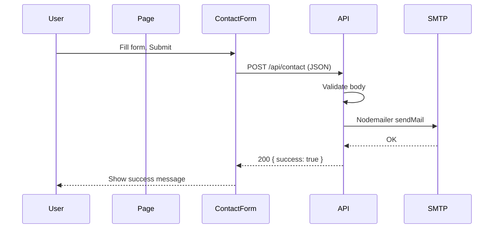

# Portfolio UI and Backend Integration

## Current state

- **Next.js 16** App Router with Tailwind v4 and TypeScript ([app/page.tsx](app/page.tsx), [app/layout.tsx](app/layout.tsx)).
- No `lucide-react`; no API routes; default starter page.
- Gemini code is a single React file with inline `userData`, client state (`activeTab`), and an unstyled contact form with no submit logic.

## 1. Dependencies and types

- **Add** `lucide-react` for icons and `nodemailer` (plus `@types/nodemailer` in dev) for the contact API.
- **Add** `tailwind-animate` (or equivalent) so `animate-in`, `fade-in`, `slide-in-from-bottom-4` work; alternatively define minimal keyframes in [app/globals.css](app/globals.css) and use standard Tailwind classes.

## 2. Data and types

- **Introduce a shared portfolio data type** (e.g. in `lib/types.ts` or `data/portfolio.ts`) for `userData`: name, title, contact, socials, summary, services (with icon name/key), experience, education, skills, projects.
- **Move** the hardcoded `userData` into a **data module** (e.g. `data/portfolio.ts`) so the page and components consume it. Keep services as data (e.g. `icon: "Code"`) and map to Lucide components in the UI to avoid storing JSX in data.
- **Add** `github` to `socials` in data and use it in the sidebar (replace the current `href="#"` for GitHub).

## 3. Component structure

Split the single-file UI into Next.js-friendly pieces under `components/`:

| Component          | Responsibility                                                                         |
| ------------------ | -------------------------------------------------------------------------------------- |
| `Sidebar`          | Profile image, contact list, social links; receives `userData`.                        |
| `ContactItem`      | Single contact row (icon, label, value).                                               |
| `Nav`              | Tab list; receives `activeTab` and `setActiveTab`.                                     |
| `SectionHeading`   | Reusable section title with underline.                                                 |
| `AboutSection`     | About text + Core Expertise grid; receives `userData`.                                 |
| `ResumeSection`    | Experience, Education, Technical Skills; receives `experience`, `education`, `skills`. |
| `PortfolioSection` | Project cards with hover/link; receives `projects`.                                    |
| `ContactSection`   | Map iframe + “Get in Touch” form (see below).                                          |

- **Client boundary:** Only the **page** (or a thin wrapper like `PortfolioClient`) needs `"use client"` because of `useState('activeTab')`. All section components can remain server components except the one that holds the form (or the form itself) if we use client-side submit.
- **Contact form:** Implement as a client component (e.g. `ContactForm` inside `ContactSection`) with controlled inputs, `onSubmit` calling `POST /api/contact`, and loading/success/error state and messages.

## 4. Page and layout

- **Replace** [app/page.tsx](app/page.tsx) with the main layout: sidebar + main content area; render `<Nav>`, then conditionally render `AboutSection` | `ResumeSection` | `PortfolioSection` | `ContactSection` based on `activeTab`. Pass data from the portfolio data module.
- **Update** [app/layout.tsx](app/layout.tsx) metadata (title, description) to portfolio-specific values.
- **Optional:** Keep or adjust [app/globals.css](app/globals.css) so existing Tailwind theme vars do not override portfolio colors (`#121212`, `#ffdb70`, etc.); the portfolio can rely on its own classes.

## 5. Contact API and backend

- **New route:** `app/api/contact/route.ts`.
  - Accept `POST` with JSON body: `name`, `email`, `subject`, `message`.
  - Validate required fields and basic email format; return 400 with a clear message if invalid.
  - Use **Nodemailer** with SMTP (e.g. Gmail, SendGrid SMTP, or any SMTP server) to send an email to your inbox (e.g. `muhammadhaseebtcf@gmail.com`). Use env vars for credentials so nothing is committed.
  - **Env vars** (e.g. in `.env.local`):  
  `SMTP_HOST`, `SMTP_PORT`, `SMTP_SECURE`, `SMTP_USER`, `SMTP_PASS`, `CONTACT_TO` (recipient email). Document these in a short README or comment.
  - On success: return 200 with `{ success: true }`. On send failure: return 500 and a safe error message.
- **Security:** Optional but recommended: rate limit by IP or add a simple honeypot / server-side check to reduce abuse. Not required for MVP but good to note.

## 6. Flow summary

## 7. File checklist

- `package.json`: add `lucide-react`, `nodemailer`; dev add `@types/nodemailer`. Optional: `tailwind-animate`.
- `lib/types.ts` (or inline in data): portfolio and contact types.
- `data/portfolio.ts`: `userData` (and any constants) with `github` in socials.
- `components/Sidebar.tsx`, `ContactItem.tsx`, `Nav.tsx`, `SectionHeading.tsx`, `AboutSection.tsx`, `ResumeSection.tsx`, `PortfolioSection.tsx`, `ContactSection.tsx` (with embedded `ContactForm` client component or form in a client wrapper).
- `app/api/contact/route.ts`: POST handler, validation, Nodemailer send.
- `app/page.tsx`: client page composing sidebar + main + nav + sections; import data from `data/portfolio.ts`.
- `app/layout.tsx`: metadata update.
- `app/globals.css`: optional animation keyframes or `@import "tailwind-animate"` if used.
- `.env.local.example`: list `SMTP_*` and `CONTACT_TO` so you can copy and fill without committing secrets.

## 8. Testing

- Run `npm run dev`, click through About / Resume / Portfolio / Contact; confirm layout and data.
- Submit contact form with valid data; confirm email received and 200 response.
- Submit with missing or invalid fields; confirm 400 and error message in UI.
- Confirm GitHub link in sidebar uses `userData.socials.github` and opens correct profile.

