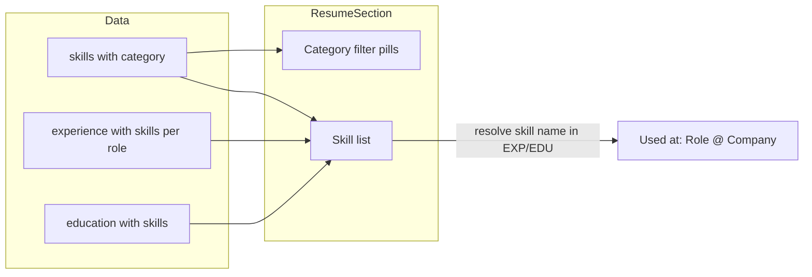

# Update Education, Experience, and Skills Sections

## Current state

- **Experience**: Timeline with role, company, period, and bullet points ([ResumeSection.tsx](components/ResumeSection.tsx)). Types in [lib/types.ts](lib/types.ts): `company`, `role`, `period`, `points[]`.
- **Education**: Timeline with institution, period, degree. No skills or logo.
- **Skills**: Flat list of strings rendered as pills in one block. No categories.
- **Theme**: Dark background `#1e1e1f`, accent `#ffdb70`, borders `#383839`, muted text `#d6d6d6` (used in [page.tsx](app/page.tsx), [ResumeSection.tsx](components/ResumeSection.tsx), [SectionHeading.tsx](components/SectionHeading.tsx)).

## 1. Data model changes ([lib/types.ts](lib/types.ts))

- **Experience**: Add optional `employmentType` (e.g. "Full-time", "Internship"), `location`, `workType` ("Hybrid", "Remote", "On-site"), `skills` (string[] for this role), and optionally `duration` (e.g. "1 yr") for display. Keep `points[]` for bullet list. Add optional `logo` (URL or placeholder key) if you want company logos later.
- **Education**: Add optional `skills` (string[]) for the diamond-style skills row under each entry.
- **Skills**: Replace `skills: string[]` with a structure that supports categories. Recommended:

```ts
// Skill with category for filtering and optional "used at" derivation
export interface PortfolioSkill {
  name: string;
  category: string; // e.g. "Tools & Technologies", "Languages", "Interpersonal Skills"
}
// In PortfolioData: skills: PortfolioSkill[];
```

"Used at: Role @ Company" can be derived at render time by scanning `experience` and `education` for entries whose `skills` array contains the skill name.

## 2. Data content ([data/portfolio.ts](data/portfolio.ts))

- **Experience**: Add `employmentType`, `location`, `workType`, and `skills` to each job (and optional `duration`). Align company/role names and dates with the reference (e.g. WAMO LABS, Devsinc, W Group; multiple roles at Devsinc if desired).
- **Education**: Add `skills` arrays to each education entry (e.g. "web developer", "Django", "HTML", "React.js").
- **Skills**: Replace the flat `skills` array with `PortfolioSkill[]` and assign each skill a `category`. Use categories from the references: e.g. "Tools & Technologies", "Languages", "Interpersonal Skills", "Industry Knowledge". Ensure names match those used in experience/education `skills` so "used at" can be derived.

## 3. Experience section UI ([components/ResumeSection.tsx](components/ResumeSection.tsx))

- Switch from timeline to a **vertical list of cards** (or one card per role).
- Each entry:
  - **Logo**: Placeholder (e.g. initial or icon in a rounded box) using `bg-[#2b2b2c]` / `border-[#383839]` to match [Sidebar](components/Sidebar.tsx).
  - **Title row**: Role (bold, larger), then company and employment type (e.g. "WAMO LABS · Full-time") in accent/muted.
  - **Meta row**: Period and duration (e.g. "Mar 2025 - Present · 1 yr"), then location and work type (e.g. "Lahore, Punjab, Pakistan · Hybrid").
  - **Bullets**: Keep existing `points` as list.
  - **Skills row**: If `skills.length`, show a diamond icon (e.g. Lucide `Gem` or custom) + comma-separated skills or small tags; optional "+N skills" if you cap display.
- **Grouping by company** (optional): If multiple roles share the same company, render a single company header with a vertical connector and sub-cards for each role (as in the reference). Logic: group `experience` by `company` and render accordingly.

## 4. Education section UI ([components/ResumeSection.tsx](components/ResumeSection.tsx))

- Same card-based style as experience for consistency.
- Each entry:
  - **Logo**: Placeholder (e.g. institution initial or BookOpen in rounded box).
  - **Institution** (bold), **degree** (e.g. "Bachelor's degree, Information Technology"), **period** (e.g. "Oct 2018 - Sep 2022").
  - **Skills row**: If `education.skills?.length`, diamond icon + skills (same style as experience).

## 5. Skills section with categories ([components/ResumeSection.tsx](components/ResumeSection.tsx))

- **Category filters**: Horizontal pill buttons (e.g. "All", "Tools & Technologies", "Languages", "Interpersonal Skills"). Use current theme:
  - Default pill: `border border-[#383839]`, `text-[#d6d6d6]`, `bg-[#1e1e1f]` or transparent.
  - Active pill: `bg-[#ffdb70]` (or similar accent), `text-black` for contrast.
- **List**: Below pills, a single column list. Each row:
  - **Skill name** (bold).
  - **Used at** (optional): One line derived from data: e.g. "Associate Team Lead at WAMO LABS" or "3 experiences at Devsinc" or "Punjab University College of Information and Technology (PUCIT)" by scanning `experience` and `education` for entries that include this skill in their `skills` array. Use a small icon (e.g. Briefcase for work, GraduationCap for education) to match references.
- **Filtering**: When a category is selected, show only skills in that category; "All" shows every skill. Get unique categories from `skills.map(s => s.category)` (and sort if desired).

## 6. Layout and theme consistency

- Keep the existing two-column grid for Resume if it fits (e.g. Experience left, Education + Skills right), or switch to a single column so experience/education cards and the skills block have more room. The reference images use a single main column; recommend **single column** for Experience and Education, then Skills below (or keep two columns with Experience | Education, then full-width Skills).
- Reuse existing tokens: `text-white`, `text-[#ffdb70]`, `text-[#d6d6d6]`, `border-[#383839]`, `bg-[#212123]` / `bg-[#1e1e1f]`, `rounded-3xl` / `rounded-xl`, and the same section heading style from [SectionHeading](components/SectionHeading.tsx).
- No new global CSS required; use Tailwind only.

## 7. Optional enhancements (out of scope unless you want them)

- Add/edit icons (pencil, plus) are in the reference for LinkedIn; omit for a static portfolio unless you add a CMS or client-side editing.
- Company/institution logos: data model supports a `logo` URL later; for now placeholder (initial or icon) is enough.
- Certifications or "Passed LinkedIn Skill Assessment" / "endorsements": not in current types; can be added in a follow-up if needed.

## File change summary


| File                                                         | Changes                                                                                                                                                |
| ------------------------------------------------------------ | ------------------------------------------------------------------------------------------------------------------------------------------------------ |
| [lib/types.ts](lib/types.ts)                                 | Add `PortfolioSkill`, extend `PortfolioExperience` and `PortfolioEducation` with optional fields, change `PortfolioData.skills` to `PortfolioSkill[]`. |
| [data/portfolio.ts](data/portfolio.ts)                       | Populate new experience/education fields, migrate skills to categorized list.                                                                          |
| [components/ResumeSection.tsx](components/ResumeSection.tsx) | Redesign Experience and Education as card lists with meta and skills rows; add categorized Skills with filter pills and "used at" derivation.          |


## Data flow (skills "used at")




No new dependencies; Lucide icons already used (add `Gem`, `GraduationCap` if needed).